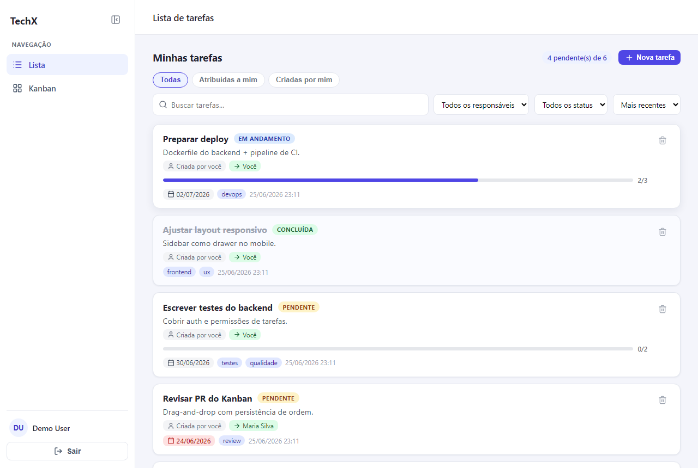
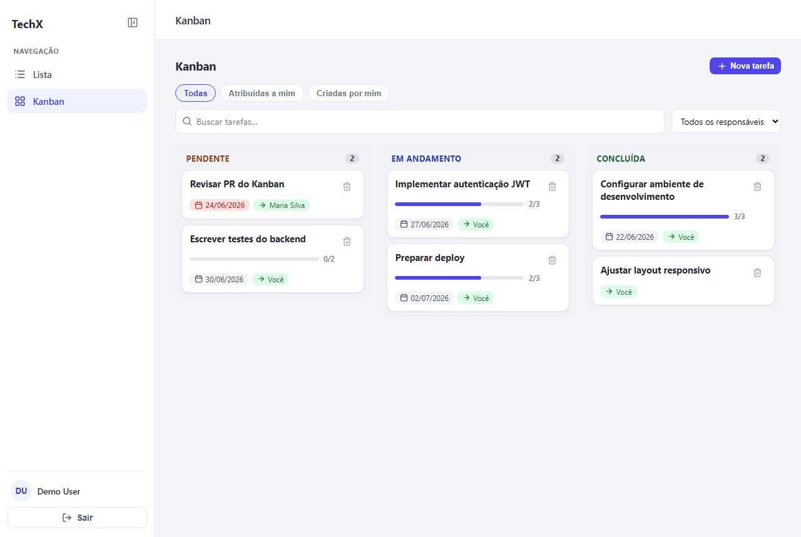
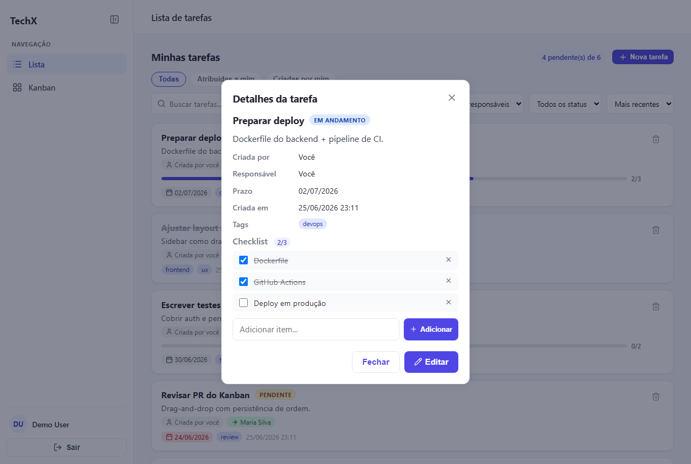
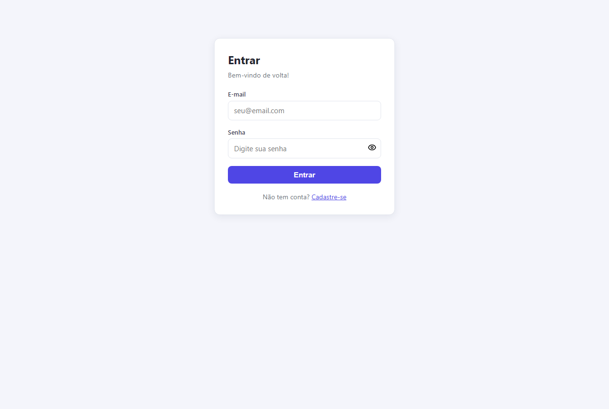

# TechX — To-Do List (Desafio Full Stack)


Aplicação web de gerenciamento de tarefas (To-Do List) desenvolvida como desafio técnico.

- **Frontend:** Angular 19 (standalone components, signals)
- **Backend:** Node.js + TypeScript + Express
- **Banco principal:** MySQL (via Prisma ORM)
- **Banco extra (NoSQL):** MongoDB (via Mongoose) — armazena metadados das tarefas (tags, notas e histórico de atividades)
- **Autenticação:** JWT (JSON Web Token) com senhas protegidas por bcrypt

## Funcionalidades

- Cadastro e login de usuários (JWT)
- Listagem de tarefas do usuário autenticado
- Criar, editar e excluir tarefas
- Status de tarefa com badges: **Pendente**, **Em andamento**, **Concluída** (troca rápida na lista)
- Prazo (data de vencimento) com destaque visual para tarefas vencidas
- Checklist de subitens por tarefa, com barra de progresso no card
- Atribuir tarefas a outros usuários; cada tarefa registra quem criou e o responsável
- Listagem mostra tarefas criadas pelo usuário **ou** atribuídas a ele
- Tags e histórico de atividades de cada tarefa (MongoDB)
- Visão **Lista** e visão **Kanban** (arrastar e soltar com ordem persistida)

---

## Demonstração

| Lista | Kanban |
| --- | --- |
|  |  |

| Detalhes da tarefa | Login |
| --- | --- |
|  |  |

> **Conta de demonstração:** `demo@techx.com` / `demo123` (criada pelo seed — ver abaixo).

---

## Pré-requisitos

- [Node.js](https://nodejs.org/) 18+ (testado com v22)
- [Docker](https://www.docker.com/) + Docker Compose (para subir MySQL e MongoDB)

> Sem Docker? Basta ter um MySQL e um MongoDB acessíveis e ajustar as URLs no `backend/.env`.

---

## Opção rápida: tudo via Docker

Sobe bancos **e** a API de uma vez. No start, o container aplica as **migrations** e roda o
**seed** automaticamente (usuário demo + tarefas de exemplo):

```bash
docker compose up --build
```

- API: `http://localhost:3333`
- Em seguida, rode só o frontend (passo 3) e entre com **`demo@techx.com` / `demo123`**.

> Para desenvolver o backend localmente (hot-reload), use os passos 1 e 2 abaixo.

---

## 1. Subir os bancos de dados

Na raiz do projeto:

```bash
docker compose up -d
```

Isso sobe:
- **MySQL 8** em `localhost:3306` (banco `techx`)
- **MongoDB 7** em `localhost:27017`
- **Adminer** (UI do MySQL) em `http://localhost:8080`

---

## 2. Backend

```bash
cd backend
npm install
cp .env.example .env        # no Windows: copy .env.example .env
npx prisma migrate dev      # cria as tabelas no MySQL
npm run seed                # (opcional) popula usuário demo + tarefas de exemplo
npm run dev
```

API disponível em **http://localhost:3333**.

> Após o seed, entre com **`demo@techx.com` / `demo123`** para ver o app já com dados.

Variáveis de ambiente (`backend/.env`):

| Variável        | Descrição                                  |
| --------------- | ------------------------------------------ |
| `DATABASE_URL`  | Conexão MySQL (Prisma)                     |
| `MONGO_URL`     | Conexão MongoDB (Mongoose)                 |
| `JWT_SECRET`    | Segredo para assinar os tokens JWT         |
| `JWT_EXPIRES_IN`| Validade do token (ex: `7d`)               |
| `PORT`          | Porta da API (padrão `3333`)               |
| `CORS_ORIGIN`   | Origem permitida (frontend, `:4200`)       |

### Endpoints

| Método | Rota                        | Auth | Descrição                          |
| ------ | --------------------------- | ---- | ---------------------------------- |
| POST   | `/api/auth/register`        | —    | Cadastra usuário e retorna token   |
| POST   | `/api/auth/login`           | —    | Autentica e retorna token          |
| GET    | `/api/users`                | ✅   | Lista usuários (para atribuição)   |
| GET    | `/api/tasks`                | ✅   | Lista tarefas criadas por ou atribuídas ao usuário |
| POST   | `/api/tasks`                | ✅   | Cria tarefa                        |
| GET    | `/api/tasks/:id`            | ✅   | Detalha tarefa (+ metadados Mongo) |
| PUT    | `/api/tasks/:id`            | ✅   | Edita tarefa                       |
| DELETE | `/api/tasks/:id`            | ✅   | Remove tarefa                      |

Rotas com ✅ exigem o header `Authorization: Bearer <token>`.

---

## 3. Frontend

```bash
cd frontend
npm install
npm start
```

Aplicação em **http://localhost:4200**.

O endereço da API está em `frontend/src/app/core/api.config.ts` (padrão `http://localhost:3333/api`).

---

## Testes

**Backend** (Jest + supertest — unitários com mocks, não precisa de banco):

```bash
cd backend
npm test
```

Cobre: registro/login (hash, e-mail duplicado, credenciais inválidas), permissões de tarefas
(criador ou responsável) e proteção de rotas por JWT.

**Frontend** (Jasmine/Karma):

```bash
cd frontend
npm test -- --watch=false --browsers=ChromeHeadless
```

Cobre: lógica do `TasksStore` (busca, filtros, ordenação, prazo vencido, progresso) e o `ToastService`.

---

## Segurança

- **helmet** — cabeçalhos HTTP de segurança.
- **express-rate-limit** — limite de 10 requisições / 15 min nas rotas `/api/auth` (anti brute-force).
- Senhas com **bcrypt**; autenticação por **JWT**. Em produção, defina um `JWT_SECRET` forte
  (`openssl rand -hex 32`).

---

## Estrutura do projeto

```
.
├── docker-compose.yml      # MySQL + MongoDB + Adminer
├── backend/                # API REST (Express + TS + Prisma + Mongoose)
│   ├── prisma/schema.prisma
│   └── src/
│       ├── config/         # variáveis de ambiente
│       ├── lib/            # clientes Prisma/Mongo, helpers
│       ├── middleware/     # auth JWT + tratamento de erros
│       ├── models/         # schema Mongoose (metadados)
│       └── modules/        # auth e tasks (rotas, controllers, services)
└── frontend/               # SPA Angular
    └── src/app/
        ├── core/           # services, models, guard, interceptor
        └── features/       # telas de auth e de tarefas
```

---

## Decisões técnicas

- **Prisma para MySQL + Mongoose para MongoDB:** o Prisma usa um único datasource por schema. Para usar os dois bancos exigidos, o MySQL (dados principais: usuários e tarefas) fica no Prisma e o MongoDB (metadados/atividades das tarefas) no Mongoose — separação limpa de responsabilidades.
- **Arquitetura modular no backend:** cada domínio (`auth`, `tasks`) tem rotas, controller e service isolados; acesso a dados concentrado nos services.
- **Validação com Zod** e **tratamento central de erros** via middleware.
- **Frontend standalone (Angular 19)** com signals, guard de rota e HTTP interceptor que injeta o token JWT.

## Funcionalidades extras (além do escopo) e por quê

Além do CRUD pedido, implementei recursos que aproximam a aplicação de um produto real:

- **Duas visualizações — Lista e Kanban:** a Lista é boa para leitura/edição rápida; o **Kanban**
  (colunas por status, com **arrastar e soltar**) é melhor para acompanhar o fluxo de trabalho.
  No Kanban a **ordem dos cards é manual e persistida** (campo `order` + endpoint de reordenação),
  então o quadro mantém a organização entre acessos.
- **Busca, filtros e ordenação** centralizados num *store* com signals, compartilhados pelas duas telas:
  busca por texto, filtro por responsável/status, **escopo rápido** (Todas / Atribuídas a mim /
  Criadas por mim) e ordenação (recentes/prazo/título). Facilita achar tarefas quando a lista cresce.
- **Criação/edição em modal** com acessibilidade (focus-trap, foco inicial, retorno de foco, `Esc`)
  e **validação por campo** reaproveitando os erros do backend (Zod). O modal já permite definir
  **status, responsável, prazo, tags e checklist** num só lugar.
- **Detalhes em modal** ao clicar no card, de onde também se edita — evita navegação extra.
- **Checklist por tarefa** com **barra de progresso** no card; **prazo** com destaque visual para
  vencidas; **atribuição** entre usuários (cada tarefa guarda criador e responsável).
- **Feedback e robustez de UX:** *toasts* de sucesso/erro, *skeleton* no carregamento, *empty states*
  distintos (sem tarefas × sem resultado de filtro) e **paginação** na Lista.
- **Sidebar** colapsável (estado persistido) e responsiva (vira *drawer* no mobile).

> Onde isso vive no código: estado e regras em
> [tasks.store.ts](frontend/src/app/features/tasks/tasks.store.ts); filtros em
> [task-filters](frontend/src/app/features/tasks/task-filters/); modais em
> [task-modals](frontend/src/app/features/tasks/task-modals/); Kanban em
> [kanban](frontend/src/app/features/tasks/kanban/). No backend, a reordenação em
> [tasks.service.ts](backend/src/modules/tasks/tasks.service.ts) (`reorder`).
